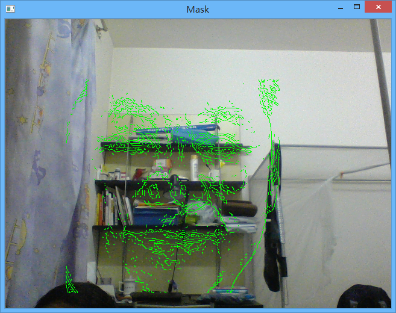

# FaceAlignmentAuxiliary

## Overview

When we need to capture a face image through camera on laptop, it is hard to align the face with the right frontal position. Using this auxiliary tool, we can take an excellent face image via one-shot.

Given a normal frontal face image, the edge of eyes and mouths are extracted, then the edges are integrated to the camera image.



## Changelog

- 2015/8/16
Create the repository.

## Environment Requirement

- Opencv 3.0.0
- Visual Studio 2013 (If you just want to use the tool, install [Visual C++ Redistributable Packages for Visual Studio 2013 (x86)](http://www.microsoft.com/en-us/download/details.aspx?id=40784) instead.)

## Deployment

You can refer to [this](http://shuaihuang.github.io/2015/08/15/opencv-deployment/) for the procedure of deployment.

## How to use it?

1. Open a command window.
2. Switch the current folder to `<repository folfer>\bin\`.
3. Type in the following command, and press enter.

```
FaceAlignmentAuxiliary.exe <referenceImg>
```
<<<<<<< HEAD
- `<referenceImg>`: the image referred for alignment.
=======
- <referenceImg>: the image referred for alignment.
>>>>>>> 439074925d93a6d4942faa0d0c3444624b427ddc
